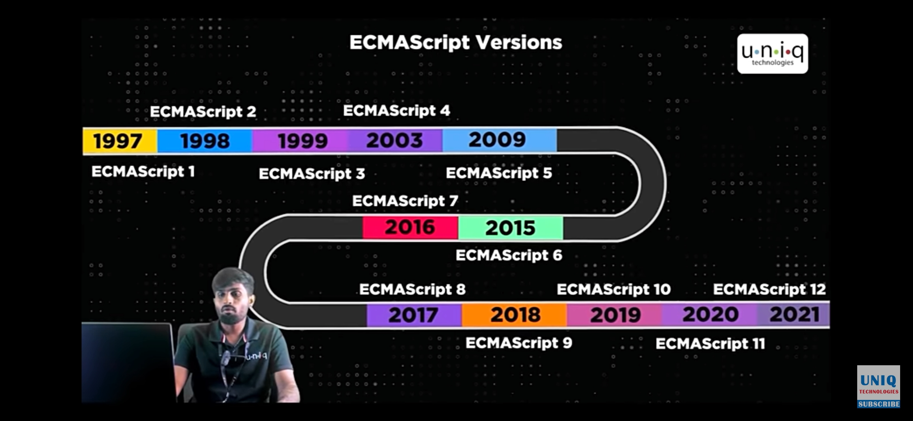

# 6 0ct 2025
## History of Javascript
**Breandan Eich** deveolped js.<br>
Name changes -> Mocha(1995)->Livescript(1996)->Js(10 days)1997-> ECMA Standard established (ECMA international)<br>
1999->ES3 comes out and IES-Microsoft is all the rage (error handling)<br>2000-2005 -> AJAX gain popularity in apps<br>
2009->DOuglas Crocford came up with the idea of OOP and ESS came out (JSON Supports)<br>2015->ES6/ECMAScrpit 2015 comes out,it has most syntatic sugar.<br>
<br>
# Module 2
It is a interpreted prog language that means it follows line by line execution.<br> It is dynamically typed language and weakly typed language ( eg: a=10 and we can reassign a="STR")<br>
It is asynchronous prog language.It can be achieved by using async,wait,callback etc...
# Oct 7 2025
- It is a event driven prog lang(i.e clicking a button to show some actions or events )<br>
- It is a single Page application (i.e If we perform any actions The page will not reload,it will give the content inside the page)
- It is a object based scripting language
# Module 3- working of Js in browser and in with HTML
The V8 engine in chrome browser converts out code into machine language and processing and gives the result(client side), in server side(Node js)
- The script tag must be at the end of the body tag because it will load all the tags and to make them dynamic
- console.log()->method shows error and output in console
- Document.write() method directly writes the content in the HTML page

```html
<!DOCTYPE html>
<html lang="en">
  <head>
    <meta charset="UTF-8" />
    <meta name="viewport" content="width=device-width, initial-scale=1.0" />
    <title>Document</title>
  </head>
  <body>
    <h1>make dynamic</h1>
    <script>
      //alert("hi")
      setTimeout(() => {
      document.querySelector("h1").innerHTML = "Im changed";
      },4000 )
      document.write("Basics of Javascipt")
    </script>
  </body>
</html>
```
# Module 4 - Intro to Prog lang and fundamentals of Js
The prog lang is lang used to communicate with the computer.
## Variable
- It is a container used to store the value (a=10)
- Three types of var declaration **let**,**var**,**const**
- keyword var_name= value;
```js
let username="keerthivasan";
var email="keerthimukesh1803@gmail.com";
const password="1234";
```
# Module 5 - Keywords
## condition based
- if,else,switch
## loop
- do,while,for,function
class - is used to create a template 
delete - is used to delete a object

## Identifier Rules
- All js variables must be identified with unique names
- Name must begin with a letter,can also begin with '$' and _,Names are case sensitive
**No internal and external scripting must be linked**<br>
Types of Casing
- Camel case -> newEmployeeId
- Pascal case -> NewEmployeeId
- Under case -> New_Employee_Id
# Module - 6 Var,Let,Const difference
```js
// var age=100; Declaration and initialization
var age;// Declaration
age=50;//Initalization or assigning
console.log(age);
var age=40 //Redeclaration
age=21//Reassign or Reinitalize

// let  newAge=100; Declaration and initialization
let newAge;// Declaration
console.log(newAge);// output -> "undefined"
newAge=150;//Intitalize
//let newAge=30; Redeclare is not possible
newAge="Keerthi"; // Reassign

// const name; is not possible both declaration and intialization performed together
const named="keerthi";
// const name="vasan";redeclare is not possible;
//named="mukesh";// error not shown here but reassign is also not possible
//console.log(named);
// Printing Statements
//alert(named)
document.write(newAge);
document.writeln("Vasan");
//confirm("named");// The difference is it has two options both ok and cancel

let userage=prompt("Enter your age")// This is used to take input from the user
document.write(userage)
console.error(123);
console.clear();// To clear the console
```
# Oct 8 2025
# Module 7 - Datatypes
## Primitive
- Number,String,Boolean,Null,Undefined
## Non Primitive
- Object ->(Array,Object,Function,Date)
```js
let a=10;
console.log(typeof(a))
let b=10.2
console.log(typeof(b));
var c=true
var c=false
console.log(typeof(c));
var d=null
console.log(d);
var e;
console.log(e) // undefined

//Non primitive data types
// Array
let arr=[1,2,3,4,"keerthi"]// Unlike other prog langs ,we can store mixed data in an array 
console.log(arr)// printing the whole array
console.log(arr.length)//return length of the array
// Normal indexing starts from 0
console.log(arr[0]);

//Object ->key value pair
let vechicle={
    vechicletype:"Car",
    Brand:"Toyota",
    color:"Blue",
    Price:600000,
    fuel:"petrol"
}
console.log(vechicle)//printing the whole object
//Accessing the individual properties using . operator
console.log(vechicle.Brand)
console.log(vechicle.Price)


let a=10;
console.log(typeof(a))
let b=10.2
console.log(typeof(b));
var c=true
var c=false
console.log(typeof(c));
var d=null
console.log(d);
var e;
console.log(e) // undefined

//Non primitive data types
// Array
let arr=[1,2,3,4,"keerthi"]// Unlike other prog langs ,we can store mixed data in an array 
console.log(arr)// printing the whole array
console.log(arr.length)//return length of the array
// Normal indexing starts from 0
console.log(arr[0]);

//Object ->key value pair
let vechicle={
    vechicletype:"Car",
    Brand:"Toyota",
    color:"Blue",
    Price:600000,
    fuel:"petrol"
}
console.log(vechicle)//printing the whole object
//Accessing the individual properties using . operator
console.log(vechicle.Brand)
console.log(vechicle.Price)
```
# Module 8 -Operators
- add,sub,mul,div,modulus,increment,decrement
# Module 9 - Pre and post increment on another variable

```js
//Post Increment
/*
1.substiute
2.Operation
3.Increment
*/
let num=20;
let num1=num++;

//num1=20++
//num1=20
//num->becames 21
console.log(num,num1) // (21,20)
// In post increment num1 is assigned with num inital value(20) only,after it num is incremented to 21

// Using multiple increments
let a1=20;
let b1= a1++ + a1++
//  b1 = 20++ ->(now a1 is updated to 21 ) + 21++(a1 is updated to 22)
// b1=20+21 =41
console.log(a1,b1) // (22,41)

//pre increment
var p1=20;
var p2=++p1;
console.log(p1,p2)//(21,21)
var p1=20;
var p2=++p1 + ++p1;
// p2= 21 + 22 =43 ,-> p1 is updated to 22
console.log(p1,p2);//(22,43)

// post decrement
var p1=20;
var p2=p1--
// p2 is assgined with 20 first and p1 value is decremented to 19
console.log(p1,p2) //(19,20)
var p1=20;
var p2=p1-- - p1--;
// p2= 20 - 19 =1 ->finally p1 is updated to 18
console.log(p1,p2)//(18,1)

// Pre decrement --a
var p1=20;
var p2=--p1;
console.log(p1,p2)//(19,19)
var p1=20;
var p2=--p1 - --p1;
// p2= 19 - 18 =1, p1=18
console.log(p1,p2)//(18,1)
```
# Module 9 - Assignment and relational operators
```js
let a=10
let b+=a; // b=b+a
console.log(a,b)// (10,20)
// Relational Operator
// == ->Equal to
// === -> Strict equal
let a11=10
let b11='10'
console.log(a11==b11)// It checks only visible chars not datatypes
console.log(a11===b11)//It checks both data types and equality
```
# Module 11 - Logical Operators
- &&->both connditon true -> true
- ||-> one condition true ->true
- ! -> !(true) = false ,, !(false)->true

# OCt 14
# Module12- String and Template String
```js
let str="keerthi"
let str1="vasan"
console.log(str+str1) // keerthivasan
console.log(str+str1+"is learning javascript");

// Template String or Template literal (` `)->not single quotes it is backspace 
let a1=`javascript`
let a2=`${a1} is a scripting language`
console.log(a2)
let num1=5;
let num2=2;
console.log(`${num1} * ${num2} = ${num1*num2}`) // for evaluating expression also
```
# Module 13-Type Conversion
```js
// Implicit conversion(Auto conversion)
str="45"
num=100
console.log(str+num) // it 45100 (string concat) data tyep->string
// String 
console.log("Hi"+true) // Hitrue
console.log("Hi"+undefined) // Hiundefined
console.log("Hi"+null) // Hinull
console.log("Hi"+[1,2]) //Hi1,2
// String + anything ===anything+string

//Number
console.log(10+true) // 11
// true-1,false-0
console.log(10+undefined) // Nan ->Not a Number
console.log(10+null) // 10+0 -> 10
console.log(10+[1,2]); // 101,2 (String)
console.log(10+{}) // 10[object object]
console.log(typeof(10+'')) // string 

//Boolean
console.log(10 + true) //11
console.log(true+undefined)//Nan
console.log(true+null) // 1+0 =1
console.log(true+[1,2]) // true1,2 (String)
console.log(true+{})// true[object object]
console.log(true+'')// true

//operations 
console.log(10+'2') //102
console.log(10-'3') //7
console.log(10*'3') //30
console.log(10-'abc')//NaN


// Explicit conversion
console.log(10+Number('10')) //20
console.log(Number('')) //0
console.log(Number('abc')) //NaN
console.log(Number(undefined)) //NaN
console.log(Number([])) //0
console.log(Number([1,2])) //NaN
console.log(Number({})) //Nan

//Boolean
console.log(Boolean(0)) // false
// Boolean values of null,undefined,0," "-> false
console.log(Boolean([]))// true
// boolean value of other than zero is true
```

